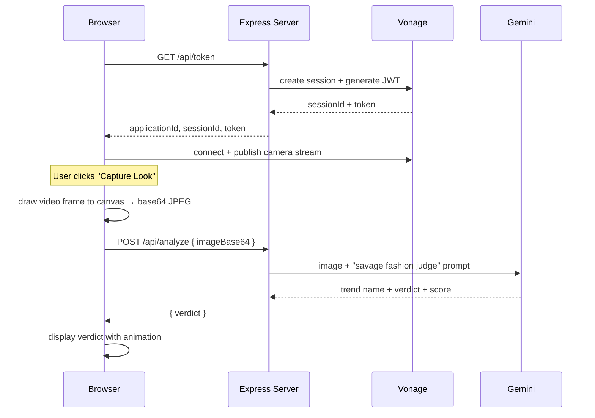

# ✨ Vogue Vision

A real-time AI fashion judge, built for the **GDG Fashion Week x Vonage/Gemini hackathon**. Point your webcam at your outfit, hit capture, and get a savage, funny verdict from Gemini — delivered over a live Vonage Video session.

## How it works



## Features

- 🎥 Live camera feed via the Vonage Video API (publish-only session)
- 📸 One-click frame capture (canvas snapshot → base64 JPEG)
- 🤖 Gemini-powered outfit roast: a made-up trend name, a one-line verdict, and a score out of 10
- 🧵 No frontend framework or build step — plain HTML/CSS/JS

## Tech stack

| Layer | Technology |
|---|---|
| Backend | Node.js (ESM) + Express |
| Live video | `@vonage/server-sdk` (server) + `@vonage/client-sdk-video` (browser) |
| AI | `@google/generative-ai` (Gemini) |
| Frontend | Static HTML/CSS/JS served from `public/` |

## Getting started

### Prerequisites

- Node.js 18+
- A Vonage Application with the Video capability enabled (Application ID + private key) — [dashboard.vonage.com](https://dashboard.nexmo.com/)
- A Gemini API key — [aistudio.google.com/apikey](https://aistudio.google.com/apikey)

### Setup

```bash
npm install
```

Create a `.env` file in the project root:

```env
# Vonage Video API
VONAGE_APPLICATION_ID=your-application-uuid
VONAGE_PRIVATE_KEY_PATH=keys/private.key

# Google Gemini
GEMINI_API_KEY=your-gemini-api-key

# Server
PORT=3000
```

Place your Vonage private key at `keys/private.key` (or wherever `VONAGE_PRIVATE_KEY_PATH` points).

> ⚠️ **Never commit `.env` or your private key.** Both are treated as secrets — see [Security](#security) below.

Run it:

```bash
npm start
```

Then open **http://localhost:3000** and allow camera access.

## Environment variables

| Variable | Description |
|---|---|
| `VONAGE_APPLICATION_ID` | Vonage Application ID (from the dashboard) |
| `VONAGE_PRIVATE_KEY_PATH` | Path to the Application's private key file |
| `VONAGE_SESSION_ID` | *(optional)* reuse a fixed session instead of creating one per boot |
| `GEMINI_API_KEY` | Google Gemini API key |
| `PORT` | *(optional)* server port, defaults to `3000` |

## API reference

### `GET /api/token`
Creates (or reuses) a Vonage session and returns a fresh publisher token.

```json
{ "applicationId": "uuid", "sessionId": "...", "token": "..." }
```

### `POST /api/analyze`
Sends a captured frame to Gemini and returns its verdict.

**Request**
```json
{ "imageBase64": "data:image/jpeg;base64,..." }
```

**Response**
```json
{ "verdict": "\"Thrifted chaos theory\" — your color coordination is chef's kiss if the chef only owns primary colors. 7/10." }
```

### `GET /vendor/opentok.js`
Serves the Vonage client SDK from `node_modules` so the browser doesn't depend on an external CDN.

## Project structure

```
vogue-vision/
├── server.js           # Express app: Vonage session/token + Gemini analysis
├── public/
│   └── index.html       # Camera UI, capture button, verdict display
├── keys/
│   └── private.key      # Vonage private key (must stay out of git)
├── package.json
└── .env                 # not committed
```

## Security

- Never commit `.env` or `keys/private.key` — both are secrets. `.env` is already git-ignored; `keys/` is too (see below).
- If a key or token is ever accidentally committed, treat it as compromised: rotate it immediately in the Vonage/Google dashboard rather than relying on removing it from a future commit.
- Avoid logging full API keys or tokens; the current backend only logs truncated previews, which is fine.

## Troubleshooting

| Symptom | Fix |
|---|---|
| Status shows "Camera active" but no video | Check browser camera permissions; try a different browser |
| `publishMessageInvalidChannel` | Don't force `audioSource`/`videoSource` in `initPublisher` — let the SDK auto-detect |
| Gemini request 404s | Confirm the model name in `server.js` is still valid/available for your API key |
| "Invalid API key or secret" (Vonage) | Confirm the Application ID and private key belong to the *same* Application, and that Video is enabled on it |

## Roadmap / stretch ideas

- [ ] Bigger, styled verdict + score reveal (color-coded by score)
- [ ] Two-person "runway battle" mode using a shared Vonage session + Signal API to broadcast both verdicts
- [ ] Virtual try-on / outfit swap using Gemini image generation
- [ ] Mobile-first responsive layout

---

Built in a single day for **GDG Fashion Week** (Vonage Video API + Google Gemini). 🧵
